# 🎉 Website Kỷ niệm 50 năm Giải phóng miền Nam và 135 năm ngày sinh Chủ tịch Hồ Chí Minh

<div align="center">
  <h2>🌐 Link Website: <a href="https://vndhieutrum.github.io/50-nam-giai-phong-135-nam-ngay-sinh-bac-ho/">https://vndhieutrum.github.io/50-nam-giai-phong-135-nam-ngay-sinh-bac-ho/</a></h2>
</div>

## 📋 Mục lục

- [Hướng dẫn cài đặt](#-hướng-dẫn-cài-đặt)
- [Hướng dẫn Deploy](#-hướng-dẫn-deploy)
- [Demo](#-demo)
- [Giới thiệu](#-giới-thiệu)
- [Mô tả các trang](#-mô-tả-các-trang)
- [Tính năng](#-tính-năng)
- [Công nghệ sử dụng](#-công-nghệ-sử-dụng)
- [Cấu trúc dự án](#-cấu-trúc-dự-án)
- [Tác giả](#-tác-giả)

## 💻 Hướng dẫn cài đặt

### Yêu cầu hệ thống

- Node.js (v14.0.0 trở lên)
- npm hoặc yarn

### Các bước cài đặt

1. Clone repository:

```bash
git clone https://github.com/KhoaCongNgheSoUTE/tkw25.nhom14.git
```

hoặc
\*Lưu ý: ở github vndhieutrum đây là dự án deploy

```bash
git clone https://github.com/vndhieutrum/50-nam-giai-phong-135-nam-ngay-sinh-bac-ho.git
```

2. Cài đặt dependencies:

```bash
npm install
# hoặc
yarn install
```

3. Chạy dự án ở môi trường development:

```bash
npm run dev
# hoặc
yarn dev
```

## 🚀 Hướng dẫn Deploy

### 1. Cài đặt Git

```bash
# Kiểm tra Git đã cài đặt
git --version

# Nếu chưa có, tải và cài đặt từ https://git-scm.com/
```

### 2. Tạo Repository trên GitHub

1. Đăng nhập vào GitHub
2. Click "New repository"
3. Đặt tên repository
4. Chọn "Public"
5. Click "Create repository"

### 3. Push code lên GitHub

```bash
git init
git add .
git commit -m "Initial commit"
git branch -M main
git remote add origin https://github.com/vndhieutrum/50-nam-giai-phong-135-nam-ngay-sinh-bac-ho.git
git push -u origin main
```

### 4. Cấu hình GitHub Pages

1. Vào repository Settings
2. Scroll xuống phần "GitHub Pages"
3. Chọn branch "gh-pages"
4. Click "Save"

### 5. Cài đặt gh-pages

```bash
npm install gh-pages --save-dev
```

### 6. Cấu hình package.json

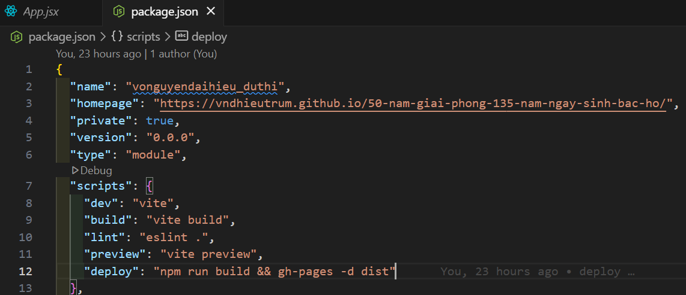

```json
{
  "homepage": "https://[Username github của bạn].github.io/[Tên repository bạn đã tạo trước đó]/",
  "scripts": {
    "predeploy": "npm run build",
    "deploy": "gh-pages -d dist"
  }
}
```

### 7. Cấu hình vite.config.js

\*Đừng quên vite.config.js nhé

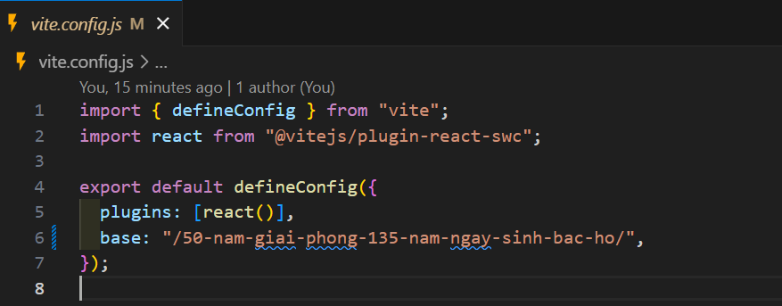
\*Lưu ý: tạo thêm base: "/[Tên repository bạn đã tạo trước đó]/", để đồng bộ đường đãn tránh lỗi path không mong muốn

```javascript
import { defineConfig } from "vite";
import react from "@vitejs/plugin-react";

export default defineConfig({
  plugins: [react()],
  base: "/[Tên repository bạn đã tạo trước đó]/",
});
```

### 8. Điều chỉnh route trong App.jsx

\*Lưu ý: trong môi trường dev thì sử dụng BrowserRouter as Router nhưng deploy thì phải chuyển thành HashRouter để có thể điêu hướng trang

```javascript
import { BrowserRouter as Router, Routes, Route } from "react-router-dom";
```

```javascript
import { HashRouter as Router, Routes, Route } from "react-router-dom";
```

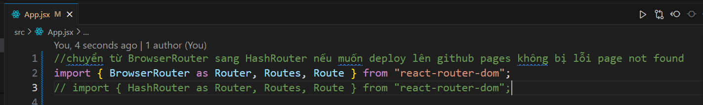

### 9. Deploy

```bash
npm run deploy
```

## 📸 Demo

<div style="display: block" align="center">
  <h3>🎯 Trang Chủ</h3>

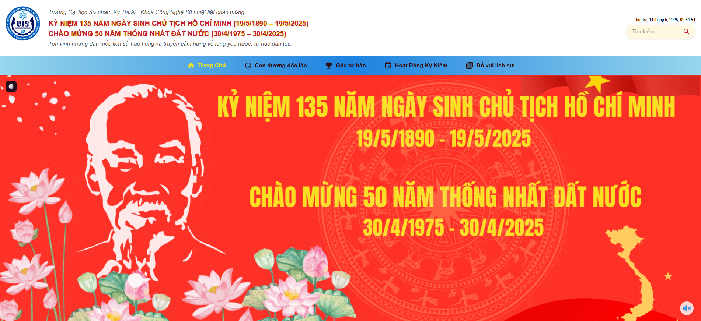
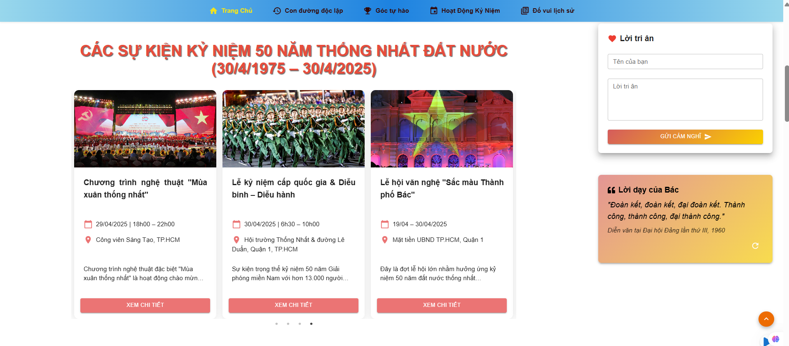

 <h3>🎮 Con Đường Độc Lập</h3>
 
 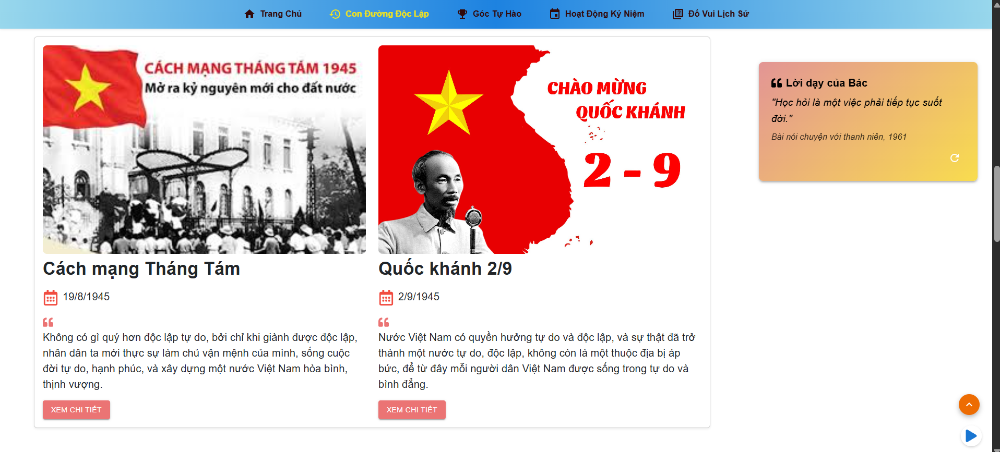
  <h3>📅 Timeline</h3>

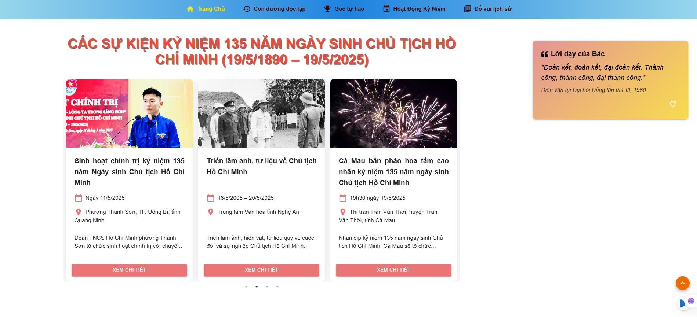
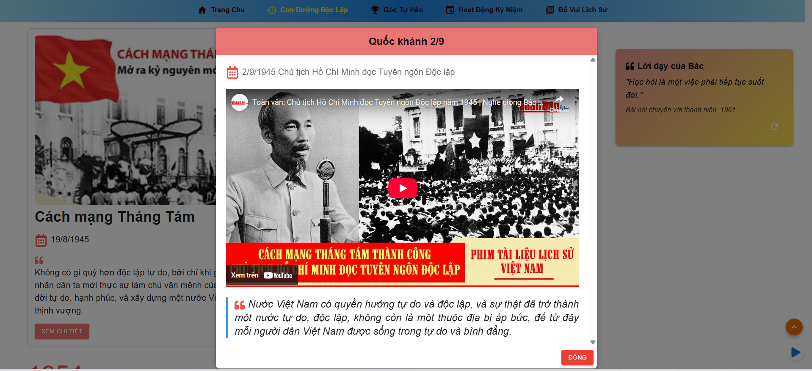

  <h3>🎮 Góc Tự Hào</h3>

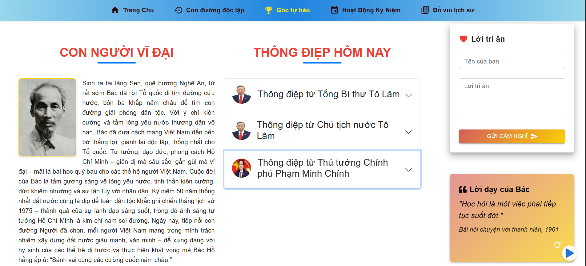
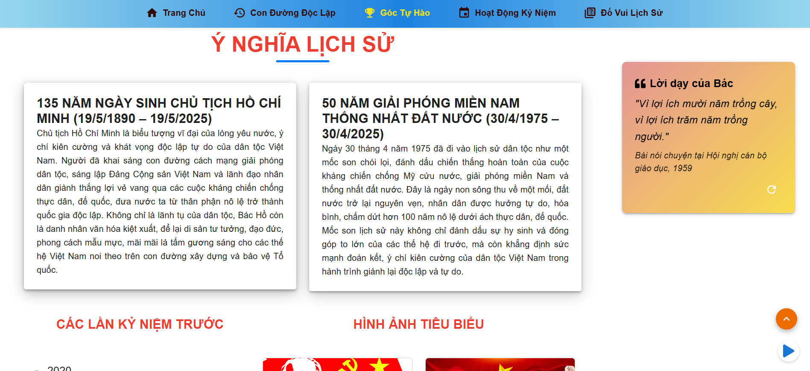
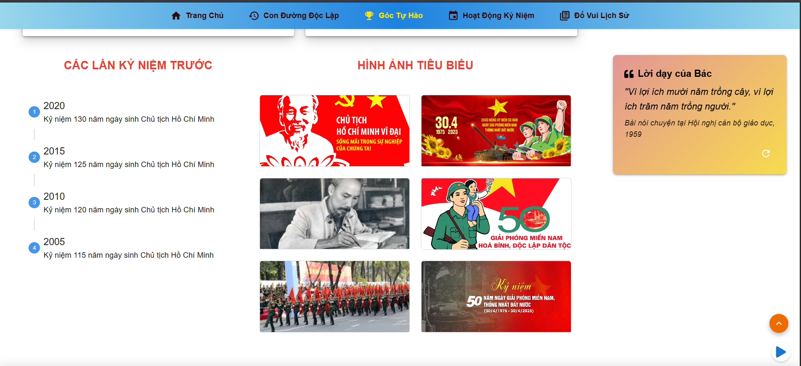

  <h3>🎮 Đố vui lịch sử</h3>

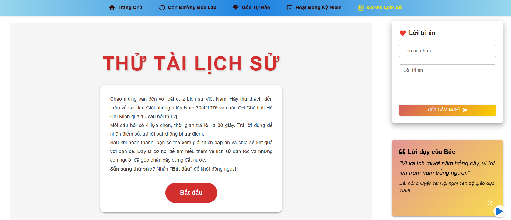
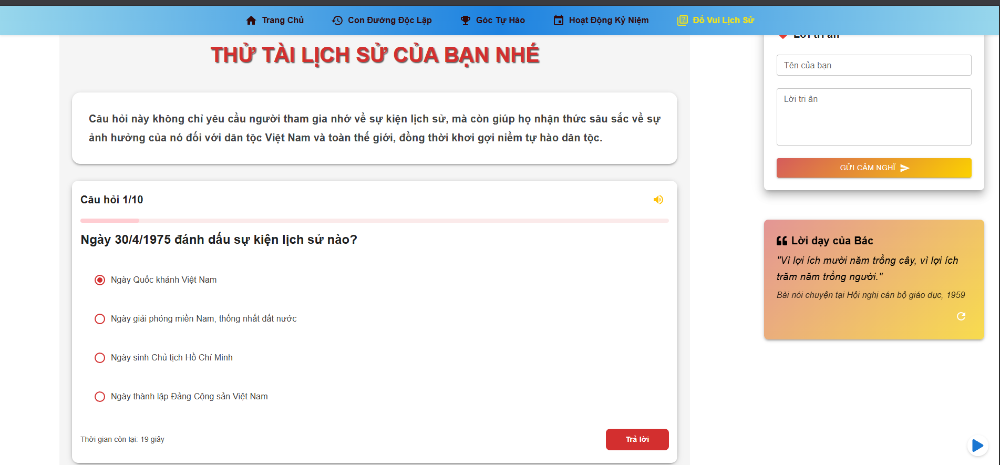

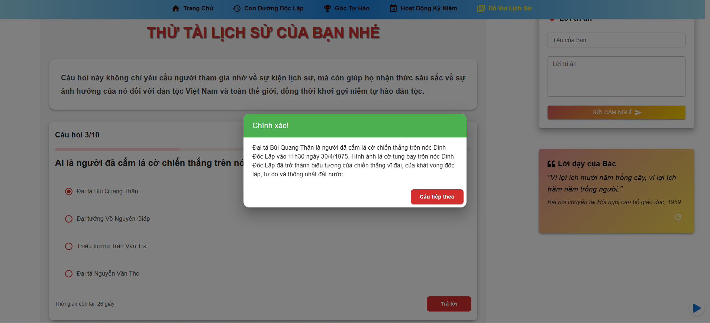
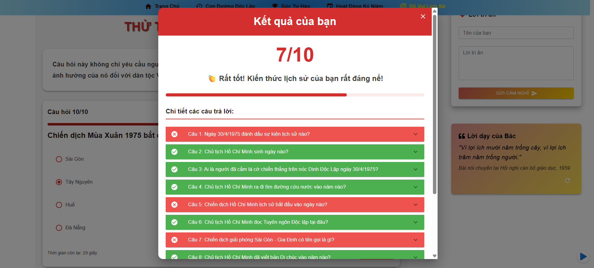


  <div style="margin-top: 30px; padding: 20px; background-color: #f8f9fa; border-radius: 10px;">
    <h3>🔗 Truy cập website</h3>
    <p>
      <a href="https://vndhieutrum.github.io/50-nam-giai-phong-135-nam-ngay-sinh-bac-ho/" target="_blank" style="color: #007bff; text-decoration: none; font-weight: bold;">
        👉 Click để xem website trực tiếp
      </a>
    </p>
  </div>
</div>

## 🎯 Giới thiệu

Website được xây dựng nhằm kỷ niệm hai sự kiện lịch sử trọng đại của dân tộc:

- 50 năm Giải phóng miền Nam, thống nhất đất nước (30/4/1975 - 30/4/2025)
- 135 năm ngày sinh Chủ tịch Hồ Chí Minh (19/5/1890 - 19/5/2025)

Dự án không chỉ là một nền tảng thông tin mà còn là công cụ giáo dục, giúp thế hệ trẻ hiểu rõ hơn về lịch sử dân tộc và tầm quan trọng của những sự kiện lịch sử này.

## 📑 Mô tả các trang

### 1. Trang Chủ (Home)

- **Hero Section**: Banner lớn với hình ảnh biểu tượng và thông điệp chính
- **Giới thiệu**: Tóm tắt về hai sự kiện lịch sử
- **Tin tức mới**: Các hoạt động kỷ niệm mới nhất
- **Thống kê**: Số liệu về các hoạt động kỷ niệm
- **Call-to-action**: Nút dẫn đến các trang chi tiết

### 2. Trang Timeline

- **Dòng thời gian tương tác**: Hiển thị các mốc sự kiện quan trọng
- **Chủ tịch Hồ Chí Minh**: Các mốc thời gian trong cuộc đời Bác
- **Giải phóng miền Nam**: Các sự kiện lịch sử từ 1973-1975
- **Hiệu ứng**: Animation khi cuộn và hover
- **Modal chi tiết**: Hiển thị thông tin chi tiết khi click vào sự kiện

### 3. Trang Gallery

- **Slider hình ảnh**: Trình chiếu ảnh tư liệu lịch sử
- **Video tư liệu**: Phát video tư liệu với React Player
- **Bộ lọc**: Lọc theo năm, sự kiện, địa điểm
- **Lightbox**: Xem ảnh full màn hình
- **Chia sẻ**: Nút chia sẻ lên mạng xã hội

### 4. Trang Đố vui

- **Trắc nghiệm**: Câu hỏi về lịch sử
- **Điểm số**: Tính điểm và xếp hạng
- **Chứng chỉ**: Tạo chứng chỉ hoàn thành
- **Lưu kết quả**: Lưu điểm số vào localStorage
- **Chia sẻ**: Chia sẻ kết quả lên mạng xã hội

### 5. Trang Góp ý

- **Form liên hệ**: Điền thông tin và gửi góp ý
- **Bản đồ**: Hiển thị địa điểm tổ chức sự kiện
- **Thông tin liên hệ**: Email, điện thoại, địa chỉ
- **Giờ làm việc**: Thời gian tiếp nhận góp ý
- **Xác nhận**: Email xác nhận sau khi gửi

### 6. Trang Giới thiệu

- **Về dự án**: Mục đích và ý nghĩa
- **Ban tổ chức**: Thông tin về team
- **Đối tác**: Logo các đơn vị tham gia
- **Liên kết**: Link đến các trang liên quan
- **FAQ**: Câu hỏi thường gặp

## ✨ Tính năng

<div style="background-color: #f8f9fa; padding: 20px; border-radius: 10px; box-shadow: 0 2px 5px rgba(0,0,0,0.1);">
<table style="width: 100%; border-collapse: collapse;">
<tr style="background-color: #e9ecef;">
<th style="padding: 12px; text-align: left; border-bottom: 2px solid #dee2e6;">Tính năng</th>
<th style="padding: 12px; text-align: left; border-bottom: 2px solid #dee2e6;">Mô tả</th>
</tr>
<tr>
<td style="padding: 12px; border-bottom: 1px solid #dee2e6;">🎨 Giao diện</td>
<td style="padding: 12px; border-bottom: 1px solid #dee2e6;">Thiết kế hiện đại, responsive trên mọi thiết bị (Mobile, Tablet, Desktop)</td>
</tr>
<tr>
<td style="padding: 12px; border-bottom: 1px solid #dee2e6;">📸 Trình chiếu</td>
<td style="padding: 12px; border-bottom: 1px solid #dee2e6;">Slider hình ảnh và video tư liệu lịch sử với hiệu ứng chuyển động mượt mà</td>
</tr>
<tr>
<td style="padding: 12px; border-bottom: 1px solid #dee2e6;">📅 Timeline</td>
<td style="padding: 12px; border-bottom: 1px solid #dee2e6;">Các mốc thời gian quan trọng trong cuộc đời Chủ tịch Hồ Chí Minh và lịch sử giải phóng miền Nam</td>
</tr>
<tr>
<td style="padding: 12px; border-bottom: 1px solid #dee2e6;">🎵 Âm thanh</td>
<td style="padding: 12px; border-bottom: 1px solid #dee2e6;">Nhạc nền và âm thanh tư liệu lịch sử, có thể tắt/bật</td>
</tr>
<tr>
<td style="padding: 12px; border-bottom: 1px solid #dee2e6;">🎮 Tương tác</td>
<td style="padding: 12px; border-bottom: 1px solid #dee2e6;">Modal chi tiết sự kiện, hiệu ứng chuyển động mượt mà với Framer Motion</td>
</tr>
<tr>
<td style="padding: 12px; border-bottom: 1px solid #dee2e6;">🔍 Đố vui lịch sử</td>
<td style="padding: 12px; border-bottom: 1px solid #dee2e6;">Trắc nghiệm kiến thức lịch sử về Chủ tịch Hồ Chí Minh và sự kiện giải phóng miền Nam</td>
</tr>
<tr>
<td style="padding: 12px; border-bottom: 1px solid #dee2e6;">📝 Góp ý</td>
<td style="padding: 12px; border-bottom: 1px solid #dee2e6;">Form để lại lời nhắn, góp ý và lời chúc tốt đẹp</td>
</tr>
<tr>
<td style="padding: 12px; border-bottom: 1px solid #dee2e6;">🌐 Đa ngôn ngữ</td>
<td style="padding: 12px; border-bottom: 1px solid #dee2e6;">Hỗ trợ tiếng Việt và tiếng Anh</td>
</tr>
</table>
</div>

## 🛠️ Công nghệ sử dụng

- **Frontend Framework**: React.js
- **UI Framework**: Material-UI (MUI), Bootstrap
- **Animation**: Framer Motion
- **Media Player**: React Player
- **Carousel**: React Slick
- **Build Tool**: Vite
- **Package Manager**: npm
- **Version Control**: Git
- **Deployment**: GitHub Pages

## 📁 Cấu trúc dự án

```
public/
├── images/....
├── videos/...
├── nhacNen.mp3
├── quizMute.mp3
├── UTE.png
src/
├── components/
│   ├── About/
│   │   ├── AboutHCM.jsx
│   │   |── Celebrate.jsx
│   │   |── HistoricalMessage.jsx
│   │   └── LeaderMessage.jsx
│   ├── BackgroundMusic/
│   │   ├── BackgroundMusic.jsx
│   │   ├── Event/
│   │   │   ├── EventModal.jsx
│   │   │   ├── Events.jsx
│   │   │   └── FeaturedEvents.jsx
│   │   ├── Historys/
│   │   │   └── HistoryDetail.jsx
│   │   ├── Home/
│   │   │   ├── Banner.jsx
│   │   │   └── HoChiMinhTimeLine.jsx
│   │   ├── RightSideBar/
│   │   │   ├── BacHoQuote.jsx
│   │   │   ├── BackToTop.jsx
│   │   │   └── UserReflection.jsx
│   │   ├── Clock.jsx
│   │   ├── Footer.jsx
│   │   ├── Header.jsx
│   │   └── Navbar.jsx
│   ├── data/.....lưu trữ dữ liệu ....
│   ├── page/
│   │   ├── About.jsx
│   │   ├── EventPage.jsx
│   │   ├── Historys.jsx
│   │   ├── Home.jsx
│   │   ├── MainLayout.jsx
│   │   └── QuizHistory.jsx
│   ├── style/....
│   ├── App.jsx
│   └── main.jsx
```

## 👨‍💻 Tác giả

- **Họ và tên**: Võ Nguyễn Đại Hiếu
- **Mã sinh viên**: 23115053122217
- **Lớp**: 23T2
- **GitHub**: [hieuvolaptrinh](https://github.com/hieuvolaptrinh)

---

<div align="center" style="margin-top: 40px; padding: 20px; background-color: #f8f9fa; border-radius: 10px;">
  <p style="font-style: italic; color: #666;">
    Website được thực hiện nhằm tôn vinh giá trị lịch sử dân tộc và thể hiện lòng tri ân các thế hệ đi trước. Cảm ơn bạn đã ghé thăm!
  </p>
</div>
